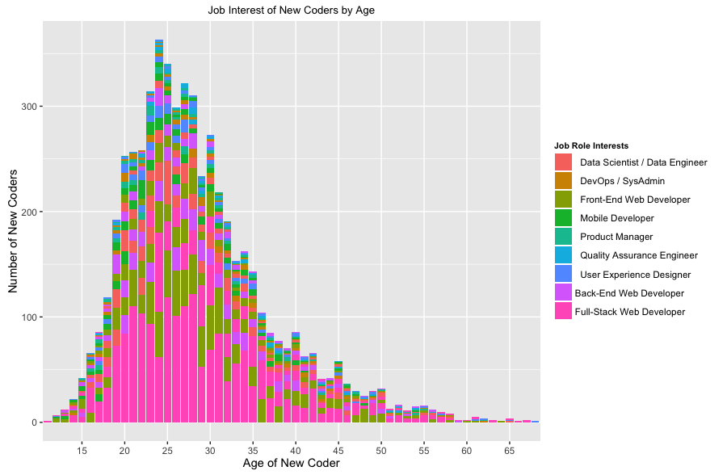
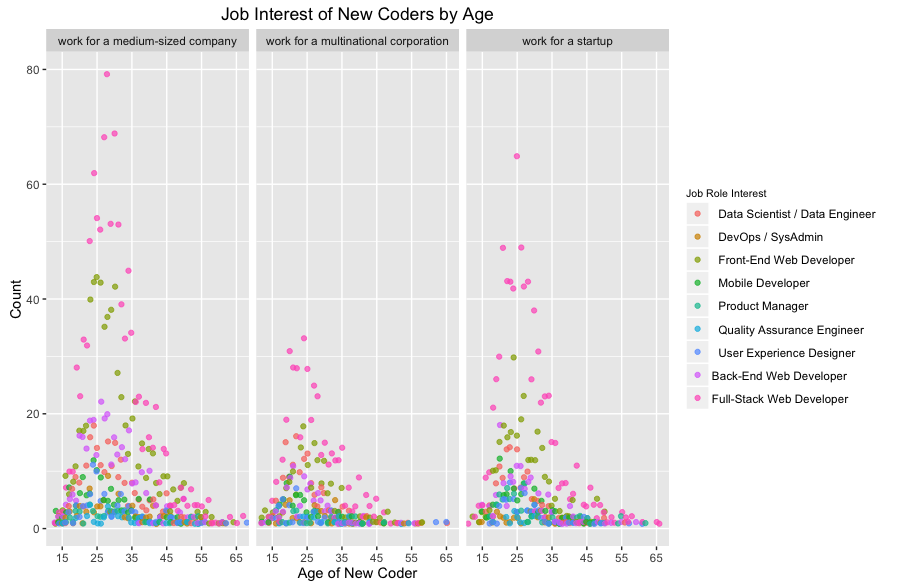

##**New Coder Job Interest and Age using R**

These data visualizations examine the relationship between the job role interests of new coders against their age.

Datasource: Kaggle's New Coder Survey dataset:
https://www.kaggle.com/freecodecamp/2016-new-coder-survey- 

**Bar Graph**

 

**Scatterplot**

In this scatterplot, new coders are also grouped by their desired company size/type. 
 


###**Interpretation of the data** 

There are signficantly more coders between the ages of 20 and 35 who want to become Full-Stack Web Developers relative to their middle to late-aged counterparts. Also, the scatterplot reveals that millennial new coders are more likely to desire employment at a medium-size company or start-up. There appears to be significantly more young coders who desire a career in Front-End Web Development as well. The remaining job role interest categories have a relatively unbiased age distribution.

###**The following steps were taken to produce these data visualization**

**Step 1:** Import the libraries:

```{r message=FALSE, warning=FALSE, echo=FALSE}
require("dyplr")
library(readr)
require("ggplot2")
require("ggthemes") 

```
**Step 2**: Import the dataset using ```read.cvs``` function:
```{r message=FALSE, warning=FALSE}
df=read.csv("NewCoders2.reformatted.csv ")
```

**Step 3:** 
Call dplyr's ```select()``` function to remove unwanted columns from dataframe:
```
df %>% dplyr::select(AGE,JOBROLEINTEREST, JOBPREF)
```

**Step 4**: Call dplyr's ```filter()``` function to remove null values from data frame:

```
 %>%  dplyr::filter(AGE!="null", JOBROLEINTEREST != "null", JOBPREF != "null")
```


**Step 5**: Call dplyr's ```group_by()``` function to group dataframe by AGE, JOBROLEINTEREST, and JOBPREF attributes:

```
 %>% dplyr::group_by(AGE, JOBROLEINTEREST, JOBPREF)
```

**Step 6**: Call dplyr's ```summarize()``` function to summarize the counts in the grouped table: 
```
 %>% dplyr::summarize(count = n())%>%dplyr::arrange(desc(count))
```

**Step 7**: Reorder rows in grouped table using dplyr's ```arrange()``` function:
```
 %>% dplyr::arrange(desc(count))
```
**Step 8**: Visualization Step

**Bar Graph**: The following ggplot layer was piped to the dataframe:

```ggplot(aes(AGE, count, fill=JOBROLEINTEREST))  + geom_bar(stat = "identity", position = "stack")  + labs(title='Job Interest of New Coders by Age') +labs(x="Age of New Coder", y= "Number of New Coders") +  scale_x_discrete(breaks = c(15,20,25,30,35,40,45,50,55,60,65)) + theme(plot.title = element_text(size=10), legend.title = element_text(size=8, face="bold")) + scale_fill_discrete(name="Job Role Interests")```

**Scatterplot**: The following ggplot layer was piped to the dataframe:

```ggplot(aes(AGE, count, color=JOBROLEINTEREST))  + theme(legend.title = element_text( size = 8)) + scale_color_discrete(name="Job Role Interest")+ geom_point(alpha = 0.7, stat = "identity", position = position_jitter(width=0.5, height= 0.5))+ labs(title='Job Interest of New Coders by Age') + labs(x="Age of New Coder", y= "Count") +facet_wrap(~JOBPREF) + scale_x_discrete(breaks = c(15,25,35,45,55,65))```
